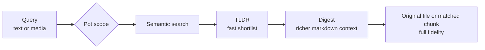

<div align="center">


[](LICENSE)
[](https://github.com/Hyper3Labs/clawdrive/releases)
[](https://huggingface.co/spaces/Hyper3Labs/clawdrive)

[Documentation](CLI.md) · [Live Demo](https://huggingface.co/spaces/Hyper3Labs/clawdrive) · [Report Bug](https://github.com/Hyper3Labs/clawdrive/issues/new?template=bug_report.md) · [Request Feature](https://github.com/Hyper3Labs/clawdrive/issues/new?template=feature_request.md)

</div>

---

<div align="center">


<br/>
<br/>
The 3D file cloud lets you browse semantic neighborhoods instead of folders.

</div>

## What is ClawDrive?

**ClawDrive** is a local-first file platform for agents and humans who need fast context from real files. It indexes text, images, audio, and video into one searchable space, then exposes that space through a CLI, REST API, and browser UI.

The core unit is a **pot**: a named collection you can build from files, folders, and URLs. Pots give you something concrete to search, hand off, and share without exposing your whole library.

> Files stay on your machine. The ClawDrive server stays on your machine. Pots define what is in scope. If you want remote access, you point your own tunnel at your local server. There is no hosted ClawDrive control plane in the middle; in the default setup, the only hosted dependency is embedding computation via Gemini.

## Quick Start

```bash
# Install globally
npm install -g clawdrive

# Set your Gemini API key
export GEMINI_API_KEY="your-key-here"

# Launch the web UI with a curated NASA demo (~248 MB on first run)
clawdrive serve --demo nasa
```

Or run directly without installing:

```bash
npx clawdrive serve --demo nasa
```

> Get a free Gemini API key at [aistudio.google.com/apikey](https://aistudio.google.com/apikey)

## Pots, Sharing, and Zero-Cloud Architecture

- A **pot** is a working set for a deal room, a customer account, a research corpus, or a handoff bundle.
- Search stays scoped to that pot instead of your entire machine.
- Shares grant access to that pot, not to everything else in your workspace.

For local collaboration, a share is a scoped permission record. For remote collaboration, you can point a tunnel such as Tailscale or Cloudflare at your local ClawDrive server and keep the same pot boundary. Storage stays local, the API stays local, and sharing stays explicit.

## Tiered Retrieval

Cheap context first, full fidelity last.



`tldr` for routing. `digest` for context. Original file when exact wording matters.

### Formats

| 📄 Documents | 🖼️ Images | 🎬 Video | 🎵 Audio |
|---|---|---|---|
| PDF, MD, TXT, JSON | JPG, PNG, GIF, WebP, SVG | MP4, MOV, WebM | MP3, WAV |

## Usage

```bash
# Create a pot (a named, shareable collection)
clawdrive pot create acme-dd

# Add files, folders, or URLs
clawdrive add --pot acme-dd ./contracts ./docs https://docs.google.com/...

# Search by meaning
clawdrive search "the nda we sent acme" --pot acme-dd

# Cross-modal search: find documents related to a photo
clawdrive search --image ./photo.jpg

# Create a scoped share for another agent or person
clawdrive share pot acme-dd --to claude-code --role read --expires 24h

# Start the API server and 3D web UI
clawdrive serve
```

See **[CLI.md](CLI.md)** for the full command reference.

### Agent-Friendly Output

Commands support `--json` for agent pipelines:

```bash
$ clawdrive search "launch telemetry" --json
```
```json
[
  {
    "id": "file_01...",
    "file": "apollo-11-transcript.pdf",
    "contentType": "application/pdf",
    "tldr": "Full transcript of Apollo 11 comms...",
    "score": 0.94
  }
]
```

---

<div align="center">

[](https://github.com/Hyper3Labs/clawdrive)

<br/>
<br/>

**Made by**  
Daniil [](https://x.com/moroz_i_holod) · Matin [](https://x.com/MatinMnM)  
Built in Berlin.

</div>

<!-- ## Star History

[](https://star-history.com/#Hyper3Labs/clawdrive&Date) -->
