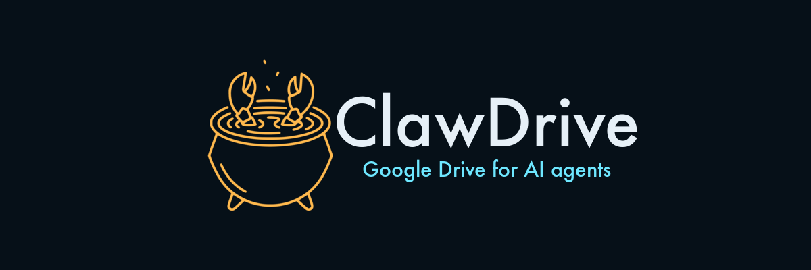
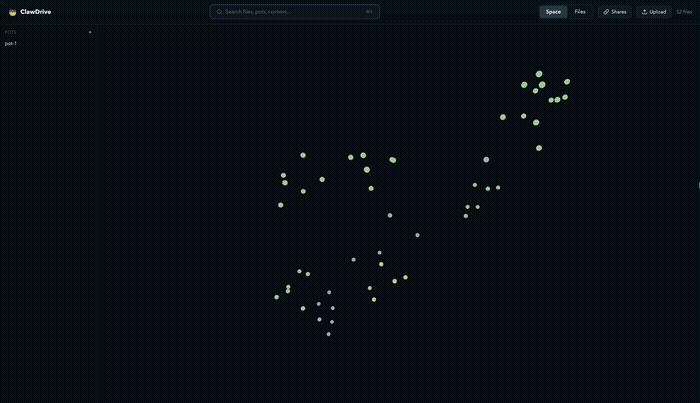
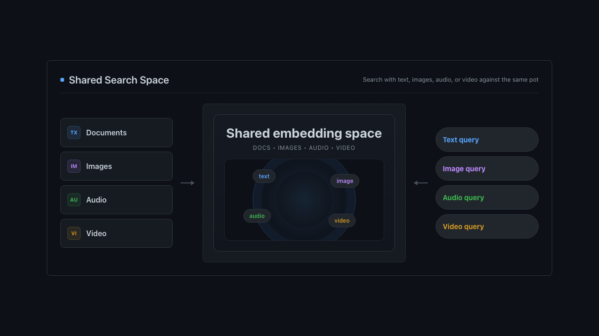
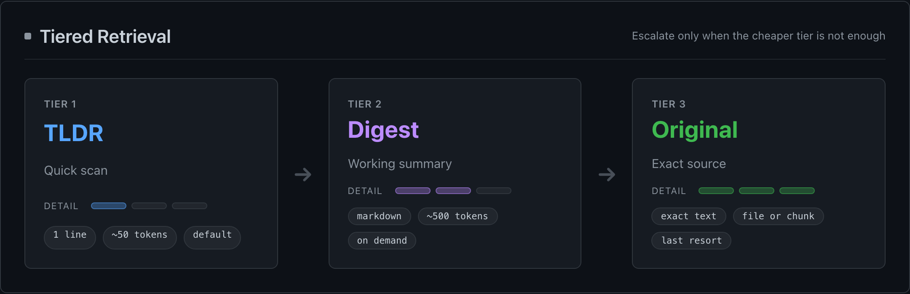

<div align="center">



[](LICENSE)
[](https://github.com/hyper3labs/clawdrive/releases)

[Website](https://claw3drive.com) · [Documentation](CLI.md) · [Live Demo](https://app.claw3drive.com/) · [Report Bug](https://github.com/hyper3labs/clawdrive/issues/new?template=bug_report.md) · [Request Feature](https://github.com/hyper3labs/clawdrive/issues/new?template=feature_request.md)

</div>

---

<div align="center">


<br/>
<br/>
Browse files by meaning, not folders.

</div>

## What is ClawDrive?

**ClawDrive** indexes your files (text, images, audio, video) and makes them searchable by meaning. You interact with it through a CLI, a REST API, or a browser UI with a 3D file cloud.

Files live in **pots**. A pot is a named collection you build from files, folders, or URLs. Search and sharing are both scoped to the pot — nothing else on your machine is visible.

> Everything runs on your machine. The only external call is to Gemini for embeddings. For remote access, point a tunnel at the local server.

## Features

- **Multimodal Shared Representation:** Text, images, audio, and video all live in the same embedding space.
- **Cross-Modal Retrieval:** Search your files by meaning—use text to find images, or images to find text.
- **Bring-Your-Own Transcriber:** Attach transcripts (e.g., from WhisperX) directly to audio and video files for deep indexing.
- **Tiered Retrieval System:** Save LLM context windows. ClawDrive returns a 1-sentence `tldr` or a markdown `digest` before you fetch the full file.
- **3D Visualization & Web UI:** Browse your files spatially with an interactive 3D frontend.
- **Pot-Based Local Sharing:** Group files into isolated "pots". Share contexts directly peer-to-peer via local tunnels (Tailscale, Cloudflare).
- **Auto File Naming & Organization:** Import everything cleanly without UUIDs; duplicates are automatically suffixed and organized.

## Quick Start

```bash
# Install globally
npm install -g clawdrive

# Set your Gemini API key
export GEMINI_API_KEY="your-key-here"

# Launch the web UI with a curated NASA demo (~248 MB on first run)
cdrive serve --demo nasa
```

The npm package is `clawdrive`; the installed CLI command is `cdrive`.

Or run directly without installing:

```bash
npx --package clawdrive cdrive serve --demo nasa
```

Prefer the hosted version? Try the live demo at [app.claw3drive.com](https://app.claw3drive.com/).

> Get a free Gemini API key at [aistudio.google.com/apikey](https://aistudio.google.com/apikey)

## Pots and sharing

A pot can be anything — a specific codebase, a side-project workspace, or a feature's design docs. All search and sharing happens at the pot level, so you never accidentally expose files outside of it.

For remote access, put a tunnel in front of the local server (Tailscale, Cloudflare, etc.). Storage stays on your machine.

## Ingest pipeline

When you add files to a pot, ClawDrive turns them into something agents can actually search. Text gets chunked and summarized, audio and video get transcribed, and images become part of the same index.

<div align="center">
  
</div>

Supported formats: PDF, Markdown, TXT, JSON, JPG, PNG, GIF, WebP, SVG, MP4, MOV, WebM, MP3, WAV.

## Tiered retrieval

Agents don't need to read an entire file to decide if it's relevant. ClawDrive returns a one-line `tldr` with every search hit, a longer `digest` on request, and the full original only when you actually need it.

<div align="center">
  
</div>

## CLI quick reference

| Command | Description |
|---------|-------------|
| `cdrive pot create <name>` | Create a pot for a project, dataset, or working set. |
| `cdrive add --pot <pot> <sources...>` | Import files, folders, or URLs into a pot. |
| `cdrive search [query] --pot <pot>` | Search by meaning, scoped to one pot when you want it. |
| `cdrive search --file <path>` | Use an image, PDF, audio, or video file as the query. |
| `cdrive get <file-or-share>` | Read a file by canonical name, or inspect a share by id or token. |
| `cdrive todo [--kind <kinds>]` | Find files still missing agent-written metadata such as `tldr`, `digest`, or `transcript`. |
| `cdrive tldr <file>` | Show or update the short summary attached to a file. |
| `cdrive share pot <pot> --to <principal>` | Create a pot-scoped share for a person or agent. |
| `cdrive share pot <pot> --link` | Create a pending link share you can approve and send out. |
| `cdrive install-skill [--agent <name>]` | Install the bundled ClawDrive skill for Claude Code, Copilot, or Codex. |
| `cdrive doctor` | Check the local workspace for configuration or health issues. |
| `cdrive serve [--demo nasa]` | Start the local API and 3D web UI, optionally in demo mode. |

Full command reference: **[CLI.md](CLI.md)**

Every command also supports `--json`:

```bash
$ cdrive search "launch telemetry" --json
```
```json
[
  {
    "id": "file_01...",
    "file": "apollo-11-transcript.pdf",
    "contentType": "application/pdf",
    "tldr": "Full transcript of Apollo 11 comms...",
    "score": 0.94
  }
]
```

---

[How to contribute](CONTRIBUTING.md) · [Report a vulnerability](SECURITY.md) · [MIT](LICENSE) © 2026 hyper3labs

---

<div align="center">

[](https://github.com/hyper3labs/clawdrive)

<br/>
<br/>

Built by Daniil [@moroz_i_holod](https://x.com/moroz_i_holod) · Matin [@MatinMnM](https://x.com/MatinMnM)

<br/>

Made with 🦞 in Berlin.

</div>
