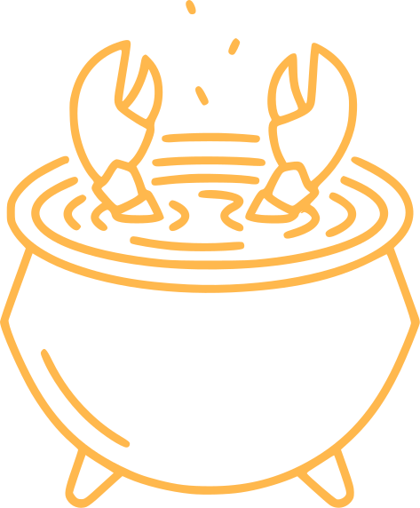

<div align="center">



### Google Drive for AI agents.

Store any file — PDFs, images, video, audio, text — and search by meaning across modalities.

[](LICENSE)
<!-- [](https://www.npmjs.com/package/clawdrive) -->

[Documentation](CLI.md) · [Report Bug](https://github.com/Hyper3Labs/hyperdrive/issues) · [Request Feature](https://github.com/Hyper3Labs/hyperdrive/issues)

</div>

---

<!-- ## Demo
[demo gif here]
-->

## 🐾 What is ClawDrive?

ClawDrive is an agent-native local file storage system with **multimodal semantic search**. Agents (and humans) can add files, organize them into shareable collections called _pots_, and find anything with natural-language or cross-modal queries.

A built-in **3D visualization** renders your entire file cloud in the browser — explore clusters, fly into search results, and see real file previews in spatial context.

<!-- ## Screenshots

<table>
  <tr>
    <td></td>
    <td></td>
  </tr>
</table> -->

## ⚡ Quick Start

```bash
# Install globally
npm install -g clawdrive

# Set your Gemini API key
export GEMINI_API_KEY="your-key-here"

# Launch the web UI with a curated NASA demo (~248 MB on first run)
clawdrive serve --demo nasa
```

Or run directly without installing:

```bash
npx clawdrive serve --demo nasa
```

> Get a free Gemini API key at [aistudio.google.com/apikey](https://aistudio.google.com/apikey)

## ✨ Features

- 🔍 **Multimodal semantic search** — query across text, images, video, and audio with a single natural-language prompt
- 🔀 **Cross-modal retrieval** — find documents related to a photo, or videos matching a text description
- 🪣 **Pots** — named, shareable file collections with fine-grained access control
- 🌐 **3D file cloud** — interactive Three.js visualization with UMAP-projected embeddings
- 🤖 **Agent-native sharing** — time-limited shares with read/write roles, built for AI agent workflows
- 🔌 **REST API** — full programmatic access for integration with any tool or agent
- 💻 **CLI-first** — every feature accessible from the terminal, with `--json` output for scripting

## 🛠 Usage

```bash
# Create a pot (a named, shareable collection)
clawdrive pot create acme-dd

# Add files, folders, or URLs
clawdrive add --pot acme-dd ./contracts ./docs https://docs.google.com/...

# Search by meaning
clawdrive search "the nda we sent acme" --pot acme-dd

# Cross-modal search: find documents related to a photo
clawdrive search --image ./photo.jpg

# Share with another agent or person
clawdrive share pot acme-dd --to claude-code --role read --expires 24h

# Start the API server and 3D web UI
clawdrive serve
```

Both `clawdrive` and `cdrive` work as the CLI command. See **[CLI.md](CLI.md)** for the full command reference.

## 🏗 How It Works

ClawDrive is a TypeScript monorepo with four packages:

| Package | Role | Key Tech |
|---|---|---|
| `core` | Storage, embedding, search, taxonomy, pots, shares | LanceDB, Gemini Embedding API |
| `server` | REST API layer | Express |
| `web` | 3D browser frontend | Vite, React, Three.js / R3F |
| `cli` | CLI entry point | Commander.js |

Files are embedded with the Gemini multimodal embedding API, stored in [LanceDB](https://lancedb.com), and projected into 3D space using UMAP. The web frontend streams those projections via the REST API and renders them with Three.js / React Three Fiber.

## 🔌 API

All endpoints accept and return JSON. The CLI supports `--json` for machine-readable output.

| Method | Endpoint | Description |
|---|---|---|
| `POST` | `/api/files/store` | Upload and embed a file |
| `GET` | `/api/files` | List all stored files |
| `GET` | `/api/search?q=...` | Semantic search across files |
| `POST` | `/api/pots` | Create a new pot |
| `GET` | `/api/pots/:pot/files` | List files in a pot |
| `POST` | `/api/shares/pot/:pot` | Create a share link for a pot |
| `GET` | `/api/projections` | Fetch UMAP projections for 3D view |

## 📋 Requirements

| Dependency | Version | Purpose |
|---|---|---|
| [Node.js](https://nodejs.org) | 18+ | Runtime |
| [ffmpeg](https://ffmpeg.org) | any | Video and audio processing |
| [Gemini API key](https://aistudio.google.com/apikey) | — | Multimodal embeddings |

## 🧑‍💻 Development

```bash
# Clone the repo
git clone https://github.com/Hyper3Labs/hyperdrive.git
cd hyperdrive

# Install dependencies
npm install

# Start dev mode (all packages in watch mode)
npm run dev

# Run tests
npm test

# Production build
npm run build
```

## 🤝 Contributing

Contributions are welcome! Please see [CONTRIBUTING.md](CONTRIBUTING.md) for guidelines.

## 🔒 Security

To report a vulnerability, please see [SECURITY.md](SECURITY.md).

## 📄 License

[MIT](LICENSE) — Copyright 2026 Hyper3 Labs

<!-- ## Star History

[](https://star-history.com/#Hyper3Labs/hyperdrive&Date) -->
